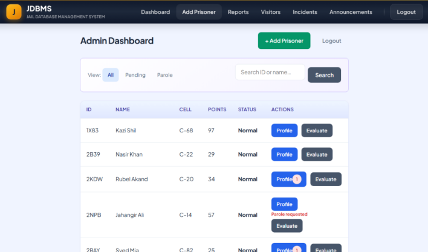
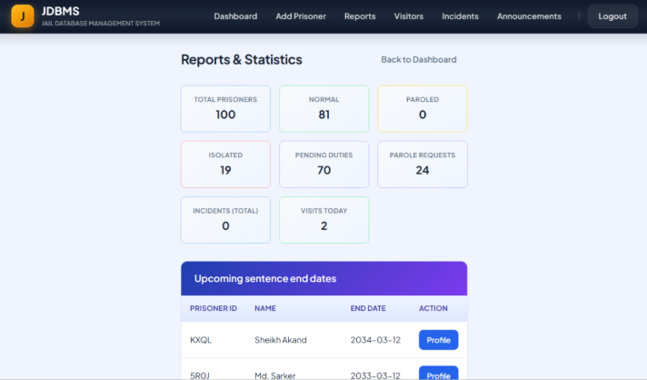
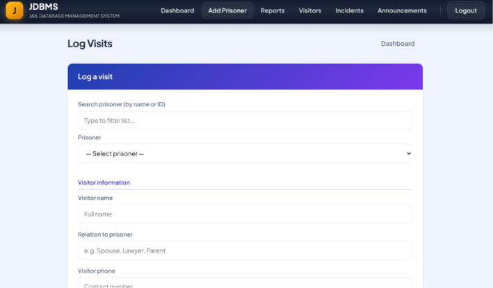
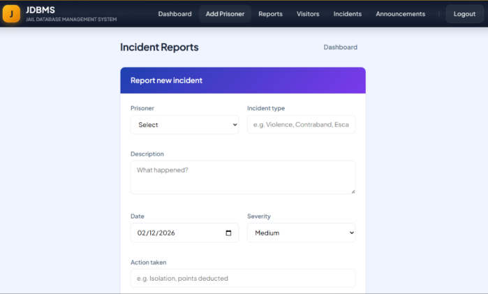
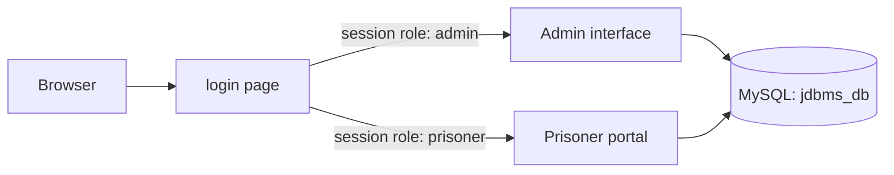
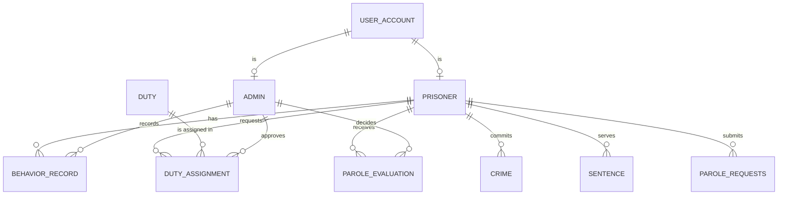

<!--
DRAFT NOTES (delete this comment block before publishing; it does not show on GitHub).
Hidden VERIFY comments mark things seen only in the screenshots, or claims I could not check
against code. Search this file for the word VERIFY, confirm each one against your newest code,
then delete the comment.
-->

# JDBMS: Jail Database Management System


**A role-based web application that replaces paper records in a correctional facility.** Administrators register and manage prisoners, assign and approve duties, track behaviour points, log visits and incidents, and run rule-based parole evaluations. Prisoners get their own portal to see their sentence, request duties and check whether they qualify for parole.

<p align="center">
  
</p>
<p align="center"><em>The admin dashboard: every prisoner at a glance, with filters for pending duty approvals and parole requests.</em></p>

## Table of contents

1. [The problem it solves](#the-problem-it-solves)
2. [Screenshots](#screenshots)
3. [Features](#features)
4. [How the parole evaluation works](#how-the-parole-evaluation-works)
5. [System architecture](#system-architecture)
6. [Database design](#database-design)
7. [Tech stack](#tech-stack)
8. [Project structure](#project-structure)
9. [Installation](#installation)
10. [Security notes](#security-notes)
11. [Roadmap](#roadmap)
12. [Credits](#credits)

## The problem it solves

Many facilities still track prisoners in paper files and spreadsheets. That makes it slow to find a record, easy to lose an update, and hard to apply parole rules fairly. JDBMS keeps everything in one relational database and applies the same rules to every prisoner:

- **One source of truth.** Personal details, crimes, sentences, duties, behaviour history and parole decisions all live in linked tables.
- **Consistent decisions.** Parole recommendations come from a transparent formula (behaviour points, time served and sentence type), not from memory.
- **Accountability.** Every behaviour change and parole evaluation is saved with the admin who made it and the date.
- **Transparency for prisoners.** A prisoner can see exactly which requirements they have and have not met.

## Screenshots

| Admin dashboard | Reports and statistics |
| --- | --- |
|  |  |

| Log a visit | Report an incident |
| --- | --- |
|  |  |

<!-- VERIFY: the screenshots show sample data only. Make sure no real names or IDs appear. -->

## Features

### Administrators

- **Dashboard.** View all prisoners with ID, name, cell, behaviour points and status. Filter by **All**, **Pending** (duty requests waiting for approval) or **Parole** (prisoners who have requested a review), and search by ID or name. A badge on each Profile button shows how many duty requests are waiting, and prisoners who asked for parole are flagged.
- **Add Prisoner.** One form registers the prisoner's login account, personal details, family and addresses, physical description, emergency contact, crime and sentence. It runs as a single database transaction, so either everything is saved or nothing is. A random 4-character prisoner ID (letters and digits) is generated automatically.
- **Edit and delete.** Update any detail of a record, or delete a prisoner together with their account.
- **Prisoner profile.** Identity, family and contact details, crimes, current sentence, duty assignments, behaviour history and past parole evaluations on one page.
- **Duty management.** Approve a prisoner's completed duty. Approval records the hours and awards matching behaviour points in one transaction.
- **Parole evaluation.** A guided screen shows the metrics, the system's recommendation and the reasons. The admin confirms or overrides the decision and adds comments. The result is logged and any pending parole request is marked as reviewed.
- **Visitors.** Log visits by searching for a prisoner and recording the visitor's name, relation and phone number. <!-- VERIFY: list any other visitor fields in your form. -->
- **Incidents.** Report an incident with the prisoner, incident type (for example violence, contraband or escape), description, date, severity and action taken. <!-- VERIFY: does an incident automatically change points or status? Say so here if it does. -->
- **Announcements.** Post announcements from the navigation bar. <!-- VERIFY: describe who sees announcements (prisoners, admins, both) and what fields an announcement has. -->
- **Reports and statistics.** Counts of total prisoners, normal, paroled and isolated prisoners, pending duties, parole requests, total incidents and visits today, plus a table of upcoming sentence end dates with a link to each profile.

### Prisoners

- **Personal portal.** Welcome page with crime type, sentence length, behaviour points and current status.
- **My personal file.** Identification details, family and emergency contact.
- **Request a duty.** Choose a duty such as Kitchen Staff, Laundry Service, Library Assistant, Cleaning, or Gardening, enter the hours worked (1 to 12) and send it to the admin for approval.
- **Duty history.** See every request and whether it is Pending or Approved.
- **Parole status.** See whether you are eligible, which requirements you meet, and request a parole review once all are met. Only one pending request is allowed at a time.

## How the parole evaluation works

Behaviour points start at **50**. Approved duty adds the hours worked as points. For each prisoner, the system compares three things against thresholds that depend on how severe the crime was:

| Crime severity | Points needed | Time served needed |
| --- | --- | --- |
| Low | 60 | 30% of sentence |
| Medium | 70 | 50% of sentence |
| Dangerous | 85 | 75% of sentence |
| Extremely Dangerous | 95 | 90% of sentence |

Rules, in order:

1. **Isolation.** If the prisoner has **20 points or fewer**, the recommendation is **Isolated** and no other check is made.
2. **Sentence type.** The sentence must allow parole.
3. **Points.** The prisoner's points must reach the number in the table.
4. **Time served.** Months served divided by total sentence months must reach the percentage in the table.

If all three checks pass, the recommendation is **Paroled**. If any fails, the recommendation is **Normal** (parole denied) and the screen lists every reason. The admin always makes the final call: grant parole, deny it, or isolate the prisoner. The prisoner's own parole page uses the same formula, so they can see in advance what they need.

## System architecture

JDBMS is a classic PHP and MySQL application with two interfaces that share one database.



**Login flow**

1. The user signs in on `index.php` (or `login.php`).
2. The credentials are checked against the `user_account` table.
3. A PHP session stores the user's id and role.
4. The user is sent to `admin_dashboard.php` or `prisoner_dashboard.php` by role.
5. Every protected page checks the session role first and redirects to the login page if it does not match.
6. `logout.php` clears and destroys the session.

## Database design

The database `jdbms_db` has ten related tables with foreign keys. <!-- VERIFY: the repo's database.sql has 10 tables. Add any new tables for visitors, incidents and announcements here and in the diagram. -->



| Table | Purpose |
| --- | --- |
| `user_account` | Login accounts: username, password and role (`admin` or `prisoner`) |
| `admin` | Admin profile linked to an account |
| `prisoner` | Full record: personal, family, physical, emergency contact, cell, security level, status (Normal, Paroled, Isolated) and total points |
| `crime` | Crime type, description, severity, date and location |
| `sentence` | Start date, duration in months and parole eligibility |
| `behavior_record` | Log of every points change with the reason and the admin who made it |
| `duty` | The list of available duties and their required hours per day |
| `duty_assignment` | A prisoner's duty request: hours assigned and completed, Pending or Approved |
| `parole_evaluation` | History of evaluations: points at the time, decision, comments, admin |
| `parole_requests` | Requests from prisoners for a parole review (Pending or Reviewed) |

**Integrity.** Foreign keys connect all tables. Deleting an account cascades to the admin or prisoner profile. Multi-step actions (adding or editing a prisoner, approving a duty) run inside database transactions, so they save completely or roll back. <!-- VERIFY: normalisation claim. Old README said the schema is in 3NF; keep that sentence only if your report supports it. -->

## Tech stack

| Layer | Technology |
| --- | --- |
| Backend | PHP 7+ (procedural, `mysqli`) |
| Database | MySQL / MariaDB |
| Frontend | HTML5 and CSS3, rendered by PHP |
| Server | Apache via XAMPP or WAMP |
| Sessions | PHP sessions for sign-in and role checks |

## Project structure

```
Jail-Database-Management-System/
├── index.php               Login page (same as login.php)
├── login.php               Login handler and form
├── logout.php              Ends the session
├── db.php                  Database connection settings
├── database.sql            Creates the database, tables and seed data
├── admin_dashboard.php     Prisoner list, filters and search
├── add_prisoner.php        Register a prisoner (transaction)
├── edit_prisoner.php       Edit a prisoner's record
├── prisoner_profile.php    Full profile, duty approval, history, delete
├── evaluate_prisoner.php   Parole evaluation and decision
├── prisoner_dashboard.php  Prisoner portal, duty requests, history
├── prisoner_parole.php     Prisoner's parole eligibility and request
├── screenshots/            Images used in this README
└── README.md
```

<!-- VERIFY: add the newer pages (reports, visitors, incidents, announcements) to the tree above with their real file names. -->

The pages for visitors, incidents, announcements and reports belong to the newer version of the project shown in the screenshots.

## Installation

### Requirements

- [XAMPP](https://www.apachefriends.org/) or WAMP (PHP 7 or newer and MySQL)
- A web browser

### Steps

1. **Get the code**
   ```bash
   git clone https://github.com/amreenhassan13/Jail-Database-Management-System.git
   ```
2. **Place it in the web folder.** Copy the project folder into XAMPP's `htdocs` directory (for example `C:\xampp\htdocs\jdbms`).
3. **Start the servers.** Open the XAMPP Control Panel and start **Apache** and **MySQL**.
4. **Create the database.** Open [phpMyAdmin](http://localhost/phpmyadmin), go to **Import**, choose `database.sql` and run it. The script creates the `jdbms_db` database and inserts a default admin and the standard duties. **Warning:** it first drops any existing `jdbms_db`.
5. **Check the connection.** `db.php` uses XAMPP's defaults (host `localhost`, user `root`, empty password, database `jdbms_db`). Change it if your setup differs.
6. **Open the app** at `http://localhost/jdbms/` (use your folder name).
7. **Sign in** with the seeded admin account, then add prisoners from the dashboard. Prisoner accounts are created by the admin in the **Add Prisoner** form.

| Role | Username | Password |
| --- | --- | --- |
| Admin | `admin` | `admin123` |

Change this default password before using the system anywhere other than your own computer.

## Security notes

**What is in place**
- Session-based sign-in, with a role check at the top of every protected page.
- Admin-only pages redirect prisoners (and anyone not signed in) to the login page.
- Database transactions for multi-step actions, so records are never left half saved.
- Prepared statements for creating accounts and prisoners, editing records, logging evaluations and saving duty requests.

**Known limitations**

This is an academic project and is not production-ready. The most important gaps are:

- Passwords are stored as plain text. They should be hashed with `password_hash()` and checked with `password_verify()`.
- Some queries still build SQL from text (the login query and several admin pages). All of them should move to prepared statements.
- Output is not consistently escaped with `htmlspecialchars()`, which leaves room for cross-site scripting.
- The seeded admin password is public, and the database connection uses the `root` user with no password. Both are fine for local development only.
- There are no CSRF tokens on forms.

## Roadmap

- [ ] Hash passwords and move every query to prepared statements
- [ ] Escape all output and add CSRF protection
- [ ] Password change and account management screens
- [ ] Export reports to PDF or CSV
- [ ] Audit log of every admin action
- [ ] Prisoner photo and document uploads
- [ ] Automated tests

## Credits

Built by Amreen Hassan and teammates. <!-- VERIFY: add your teammates' names and roles here. -->
